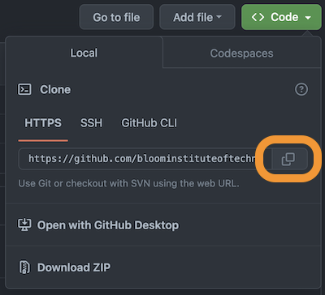
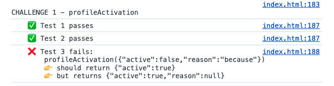

# Sprint 2 Challenge

## Overview
Welcome to the Sprint 2 Challenge! You will be completing a list of coding challenges by writing code in the `index.html` file. Each coding challenge has a set of tests that must pass in order to receive a passing grade. 

Below you will find step-by-step instructions to help you get setup and complete this Sprint Challenge. Good luck!

## 1. Setup Instructions

### Cloning the Repository
To get started, clone the repository to your local machine. Cloning creates a local copy of the project on your computer. To clone your repository, open your terminal or Git BASH and execute: 

```
git clone [your-repo-url-here]
```

You can get your repo url from GitHub by clicking on the green "<> Code" button and clicking on the copy button for the url.



### Preparing Your Environment
Once you have your files on your machine, open the `index.html` file in two programs:
  - [VSCode](https://code.visualstudio.com/download) for editing.
  - [Chrome browser](https://www.google.com/chrome/) for viewing your changes.
 In Chrome, access the Dev Tools by either right-clicking and selecting "Inspect" or Ctrl+Shift+I/Cmd+Option+I. Then navigate to the Console tab. This is where you will see the results of the tests.

## 2. Challenge Completion

### Working Through Challenges
For each challenge, read the instructions within the challenge link below and write your code in the `index.html` file. The `index.html` file has a function labeled with the challenge number where you will write your code. 
- **Challenges List:**
  - [Challenge 1](./challenges/Challenge_1.md)
  - [Challenge 2](./challenges/Challenge_2.md)
  - [Challenge 3](./challenges/Challenge_3.md)
  - [Challenge 4](./challenges/Challenge_4.md)
  - [Challenge 5 (optional)](./challenges/Challenge_5.md)
  - [Challenge 6 (optional)](./challenges/Challenge_6.md)

### Testing Your Code
To see if your code is passing the tests, open the `index.html` file in Chrome and look at the console. You will see a green checkbox for each test you pass and a red X for any tests that did not pass. 



You must pass all the tests for each challenge to receive a passing grade.

## 3. Submission Process

### Connecting to CodeGrade
Follow the instructions on Canvas to connect your project with CodeGrade. Once connected, you can submit your code by pushing your code to your GitHub repo.

### Pushing Code to GitHub
Use the following git commands to push your completed challenge to GitHub for automatic grading:
```
git add .
git commit -m 'Challenge Submission'
git push
```

At any point of the Sprint Challenge, you can submit your code to CodeGrade and you can make an unlimited number of submissions.

## Ask Us: We're Here to Support You!
If you find yourself struggling during this Sprint Challenge, don't hesitate to use LearnBot or reach out to an LA or instructor. We know coding can be challenging, especially when you're just starting out. 

Best of luck with your Sprint 2 Challenge!
